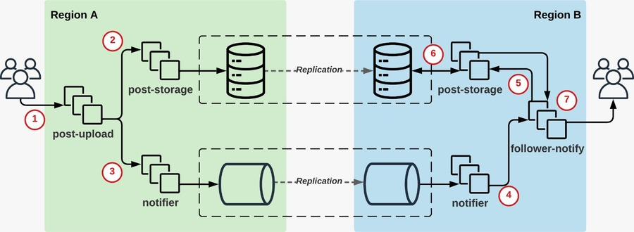

# Antipode @ Post-Notification AWS Lambda

In this repo you will find found how Antipode fixes the inconsistency found on our Post-Notification microbenchmark.

The Post-Notification application was born from a real problem in [Facebook’s infrastructure]((https://www.usenix.org/conference/hotos15/workshop-program/presentation/ajoux)), but simplified in the form of a microbenchmark that run on AWS Lambda environment, depicted in the following picture.



In this application, users can upload posts and followers receive notifications.
Internally, the application comprises two key service, each responsible for a different task in the end-to-end request flow, namely: a *Writer* service (comprised of `post-upload` and `post-storage` services) that works as a proxy for the clients and is responsible for storing and processing the contents of posts; and a *Reader* service (comprised of `notifier` and `follower-notify` services) in charge of disseminating notification events which notifies followers of new posts. 
Cross-service inconsistencies can occur in this application: followers in Region B can be notified of posts that do not yet exist in that region. 

In our implementation, we each service corresponds to a Lambda functions, which access off-the-shelf datastores. Each external client request spawns a Writer call, which writes the new post to post-storage, and then creates a new notification in the notifier. 
Meanwhile, a new Reader is spawned when a new notifier replication event is received. 
For this scenario, we consider that a cross-service inconsistency occurs when reading a post outputs object not found.
For the off-the-shelf datastores we used combinations MySQL, DynamoDB, S3, and Redis for storing posts; and SNS, AMQ, and DynamoDB for notification events.

Antipode solves this violation by placing a barrier right after the Reader receives the notification replication event.


## Prerequisites
1. Docker
2. Python 3 
3. Install requiremnts `pip3 install -r requirements.txt`
4. Install AWS cli tools `aws` (recommended version: 2)
5. Configure your local authentication profile `aws configure`
6. Copy your credentials to your home path `cp ~/.aws/credentials .`
7. Config aws according to instruction below.
8. *WARNING* In AWS, go to Service Quotas, AWS Lambda and make sure the applie quota value of concurrent executions is set to 1000 in all regions listed in the following sections.

### AWS Configurations

We assume the following regions:
- For EU we use Europe (Frankfurt) datacenter and the `eu-central-1a` availability zone
- For US we use US East (N. Virginia) datacenter and the `us-east-1a` availability zone
- For AP we use Asia Pacific (Singapore) datacenter and the `ap-southeast-1a` availability zone

For each resource configuration, don't forget to set up the correct endpoints in the corresponding sections (lambda and datastores) in connection_info.yaml.

#### IAM

1. Create a role named `antipode-cloudformation-admin` (name is defined at the end):
    - Trusted Entity Type: AWS Service
    - Use Case: search and select CloudFormation
    - Next, add the following permission policy: Administrator Access
2. Create a role named `antipode-lambda-admin` (name is defined at the end):
    - Trusted Entity Type: AWS Service
    - Use Case: Lambda
    - Next, add the following permission policies:
        - Administrator Access
        - AmazonDynamoDBFullAccess
        - AmazonEC2FullAccess
        - AmazonElastiCacheFullAccess
        - AmazonSNSFullAccess
        - AmazonSQSFullAccess
        - AmazonVPCFullAccess
        - AmazonMQFullAccess
        - AWSLambda_FullAccess
3. Create a role named `antipode-s3-admin` (name is defined at the end):
    - Trusted Entity Type: AWS Service
    - Use Case: search and select S3
    - Next, add the following permission policies:
        - AmazonS3FullAccess

4. Add the endpoints for the first two roles at the begging of connections_info.yaml.

#### S3
- Go to S3 and create one bucket for each zone. You will probably need to use a different/unique name (e.g. with some suffix). Just make sure you change the endpoints in connection_info.yaml (lambda -> s3_buckets).
  - `antipode-lambda-<region_name>`
  - leave everything as default

After configuring each of the following datastores, don't forget to set up the endpoints in datastores of connection_info.yaml.

#### SQS EVAL QUEUE
1. Go to each reader region  (`us-east-1`, `ap-southeast-1`) zone and to the AWS SQS dashboard
2. Create queue with the following parameters:
    - Standard type
    - Name: `antipode-lambda-eval`

#### VPC
As a tip use the same name for all objects, its easier to track. We use 'antipode-mq'
1. Create a VPC with a unique IPv4 CIDR block, distinct from the ones used in other regions, as exemplified in the connections info file:
    - eu: `50.0.0.0/16`
    - us: `51.0.0.0/16`
    - ap: `52.0.0.0/16`
    - *MAIN CONCERN*: Amazon MQ peering connection WILL NOT WORK ON OVERLAPPING CIDR BLOCKS ACROSS REGIONS. Hence choose a unique one for each region VPC
2. After creating select the create vpc, click on ACTIONS, go to 'Edit VPC settings' and enable DNS hostnames
3. Create two subnets, one for each Availability Zone ('a' and 'b'). For example:
    - eu: `50.0.0.0/20`, `50.0.16.0/20`
    - us: `51.0.0.0/20`, `51.0.16.0/20`
    - ap: `52.0.0.0/20`, `52.0.16.0/20`
    - *MAIN CONCERN*: Amazon ElastiCache (redis) requires an additional subnet with different AZ for the additional replica.
    - *IMPORTANT REMINDER*: the subnet id's used in connections info file correspond to the first one for each zone
4. Go to Security Groups and select the default one for the created vpc.
    - Inbound rules: Add 2 rules for ALL TRAFFIC to Any IPv4 (0.0.0.0/0) and IPv6. Make sure you have a rule for the same SG ID
    - Outbout rules: Add 2 rules for ALL TRAFFIC to Any IPv4 (0.0.0.0/0) and IPv6. Make sure you have a rule for the same SG ID
5. Create an Internet Gateway
    - After creating go to 'Actions' and attach it to the VPC
6. Go to Route Tables and select the one created (check the matching vpc id)
    - Go to Edit Routes and add an entry for 0.0.0.0/0 with target to the created internet gateway - select Internet Gateway and the id will appear
7. Go to Endpoints and create an entrypoint for AWS Services needed. Make sure you select the correct VPC, Subnet for the 'a' AZ and SG:
    - Reader (`eu-central-1`): SQS
    - Writer (`us-east-1`, `ap-southeast-1`): SNS, Dynamo (Gateway)

#### Aurora Mysql Global Cluster
- In each of the zones first create a Parameter Group (e.g. aurora-mysql5.7)
1. Go to Dashboard, click on "Parameter Groups". Create a new one
2. Although you can let the default parameters stay, later you might want to change max_connections

- Now we setup the cluster
1. Go to `eu-central-1` zone
2. Go to RDS dashboard and click on "Create Database"
3. Select "Standard Create"
    - Engine type: Amazon Aurora with MySQL compatibility
    - Select a version that supports "Global Database" feature and Provisioned with Single Master (e.g. Aurora MySQL 5.7, 2.11.2)
    - Select PRODUCTION template
    - DB cluster identifier: 'antipode-lambda-eu'
    - Credentials:
        - Master Username: 'antipode'
        - Master Password: 'antipode'
    - Select lowest memory optimized machine (e.g. db.r4.large)
        - Tick "Include previous generations" for older and cheaper instances
    - Do not create Multi-AZ deployment
    - Choose default VPC
    - Public access: YES
    - Choose 'allow-all' VPC group
    - Connectivity additional configuration:
        - Database port: 3306
    - Disable Performance Insights
    - Monitoring additional configuration:
        - Disable Enhanced monitoring
    - Additional configuration:
        - Disable Encryption
        - Disable auto minor version upgrade
        - Enable delete protection
4. Wait for all the instances to be created
5. In 'Databases', select the top level "Global Database". Click on Actions and "Add AWS region". You will get to a "Add Region" panel where you can setup the new replica:
    - Global database identifier: `antipode-lambda`
    - Secondary region: `<region_name>`
    - Select lowest memory optimized machine
    - Do not create multi-az deployment
    - Select the default VPC
        - DO NOT CHANGE antipode-mq to support RDS by adding more **subnets**
    - Enable Public access
    - Select the 'allow-all' VPC security group. If its not created, you should create with:
        - ALL TRAFFIC open for all IPv4 and IPv6, in inbound and outbound
        - Rule to allow itself - the security group - in inbound and outbound
    - Select the AZ terminated in a (?? needed)
    - Do not enable "read replica write forwarding"
    - DB instance identifier: `antipode-lambda-<region name>-instance`
    - DB cluster identifier: `antipode-lambda-<region name>`
    - Disable Performance Insights
    - Disable Monitoring
    - Disable Auto minor version upgrade

6. When everything is created, it is run `./antipode_lambda clean` that will automatically create MySQL tables
7. To provide the endpoints in the connection info file, check the cluster of each zone:
    - Primary zone: writer instance endpoint
    - Secondary zone: reader instance endpoint

ref: https://docs.aws.amazon.com/AmazonRDS/latest/AuroraUserGuide/aurora-global-database.html

#### SNS
1. Go to `eu-central-1` zone and to the AWS SNS dashboard
2. Go to Topics and create a new one with the following parameters:
    - Standard type
    - name: `antipode-lambda-notifications`

#### S3
1. Go AWS dashboard and create buckets within all zones. Note that names are unique and you will probably need to use a different one
    - Name: `antipode-lambda-posts-<region>` 
    - Enabled versioning
2. Go the bucket in the primary region, go to the Managemen tab and create replication from the bucket in that region other buckets
    - Name: `to-reader-<secondary region>`
    - Rule scope: apply to all objects
    - On Destination click 'Browse S3' and find the bucket named: `antipode-lambda-posts-<secondary region>`
    - Use the 'antipode-lambda-s3-admin' IAM role
        - This is a rule that gives S3 admin access to operations needed
    - Do not select RTC
    - When created don't choose 'replicate existing objects'

NOTE: we should also change the replication priority for each deployment (input on code and wait for changes in dashboard?)

#### DynamoDB
1. On each region create tables for `posts`, `notifications` and `posts-antipode`
    - For name and partition key check the `connection_info.yaml` file
    - Select everything default
    - In table settings, select customize settings and change `Read/Write` capacity settings to `On-demand`
2. After created go to dashboard on the primary region and select Tables:
    - For the 3 tables (`posts`, `notifications`, `posts-antipode`) do the following:
        - Go to `Global Tables`
        - Create replica to the desired region
        - Double check in secondary region if tables got created
3. For the `notifications` tables in the secondary regions, go to `Export` and `Streams` and obtain the stream ARN to be configured in the `connection_info.yaml` file

#### ELASTICACHE (Redis)
1. Go to Global Datastores and create a global cluster. Start with the primary zone (if you are adding a zone to an existing cluster just go to the dashboard and add zone). The properties are similar for the other zones you add to the cluster. Configure each zone in the `antipode-lambda` cluster:
    - Name: `antipode-lambda-<region>`
    - Port: 6379 (or the one you define in connection_info.yaml)
    - Node type: `cache.r5.large`
    - Num replicas: 1
    - Create a new Subnet group:
        - Name: `antipode-lambda-<region>`
        - Select previously created VPC and Subnet groups
        - Select the AZ preference to the only AZ that should be there
    - Select the default SG for the choosed VPC
    - Disable backups

2. Make sure the subnet in the connection info file is the one that the reader instance is using

3. Provide the endpoints in the connection info file:
    - Go to the cluster of each zone and get the 'Primary endpoint' without port

**WARN/BUG**: you might have to create an EC2 instance on the zone and perform an initial request to "unlock" the zone for EC

#### AMQ
1. Using the previously created VCP, you have to add peering between the reader and writer zone
    - Check the following material for more details:
        - https://docs.aws.amazon.com/vpc/latest/peering/create-vpc-peering-connection.html
        - https://docs.aws.amazon.com/vpc/latest/peering/vpc-peering-routing.html
      **HUGE WARNING**: WILL NOT WORK WITH VPCs WITH OVERLAPING CIDRS

    - Go to the the secondary zone and create a new Peering Connection
        - Name: `antipode-mq-<primary>-<secondary>` (e.g. antipode-mq-eu-us)
            - Select the previously created VPC
            - The select the primary zone and paste the previously created VPC id
        - Go to the Peering Connections on the primary zone and accept the pending request (you might want to change the name as well)
        - On both zones go to the Routing Table. We will match the pair the CIDR blocks
            - On zone `REGION-A` add the entry: `<REGION-B CIDR block> -> pcx-id (peering connection)`
            - On zone `REGION-B` add the entry: `<REGION-A CIDR block> -> pcx-id (peering connection)`
          At the end of the whole setup, primary should have a configuration similar to this one:
          ```
          50.0.0.0/16	local       (self)
          51.0.0.0/16	pcx-id      (peering connection to secondary, e.g. eu-us)
          52.0.0.0/16	pcx-id      (peering connection to secondary, e.g. eu-sg)
          0.0.0.0/0	  igw-id      (internet gateway)
          (you might have more entries from the endpoint configurations)
          ```

          And the secondaries should have a configuration similar to this one:
          ```
          52.0.0.0/16	local       (self)
          50.0.0.0/16	pcx-id      (peering connection to primary, e.g. eu-sg)
          0.0.0.0/0	  igw-id      (internet gateway)
          (you might have more entries from the endpoint configurations)
          ```

2. Go the all the zones and create a broker with the following configuration:
    - Engine: Apache ActiveMQ
    - Single-instance broker
    - Durability optimized
    - Broker name: `antipode-lambda-notifications-<region>` 
    - Username: `antipode`
    - Password: `antipode1antipode`
    - Broker engine: 5.16.2
    - Select to create a default configuration
    - Select pre-created VPC config: `antipode-mq`
    - Select pre-created Security group: `antipode-mq`
    - Disable maintenance
3. Double check that you CAN access the public broker management dashboard
4. Go the the PRIMARY (writer) zone and edit the created configuration by uncommeting the networkConnectors blocks and replace with this (change the uris as needed):
    ref: https://docs.aws.amazon.com/amazon-mq/latest/developer-guide/amazon-mq-creating-configuring-network-of-brokers.html
    ```xml
    <networkConnectors>
        <networkConnector duplex="true" name="ConnectorEuToUs" uri="static:(ssl://b-6cfdfde0-2f84-4723-94bd-cc9ada66c2a9-1.mq.us-east-1.amazonaws.com:61617)" userName="antipode"/>
        <networkConnector duplex="true" name="ConnectorEuToSg" uri="static:(ssl://b-6cfdfde0-2f84-4723-94bd-cc9ada66c2a9-1.mq.us-east-1.amazonaws.com:61617)" userName="antipode"/>
    </networkConnectors>
    ```

5. Go the broker again and change the REVISION of the configuration file and do APPLY IMMEDIATLY
6. In your local machine test the queue by creating a consumer on a secondary region to the primary region (change url):
    ```
    activemq consumer --brokerUrl "ssl://b-20f3cf89-7725-44b0-946b-19e84c03b81e-1.mq.us-east-1.amazonaws.com:61617" \
                    --user antipode \
                    --password antipode1antipode \
                    --destination queue://antipode-notifications
    ```

    - Double check with a producer
    ```
    activemq producer --brokerUrl "ssl://b-8b026a92-1858-4a76-bc7a-7bfb25be209d-1.mq.eu-central-1.amazonaws.com:61617" \
                --user antipode \
                --password antipode1antipode \
                --destination queue://antipode-notifications \
                --persistent true \
                --messageSize 1000 \
                --messageCount 10
    ```

    - Go the the dashboard of the created broker in AWS (ActiveMQ Web Console -> Manage ActiveMQ Brocker -> Queues) and you should see 10 messages enqueued and dequeued

7. In your local machine create a secret for MQ lambda access on the primary region:
    `aws secretsmanager create-secret --region us-east-1 --name antipode-mq --secret-string '{"username": "antipode", "password": "antipode1antipode"}' `
    - After created edit the secret and replicate to secondary regions if needed (ap-southeast)


## Usage
Build Docker image
> docker build -t antipode-lambda .

For instance, for a post-storage backend with mysql and notification storage with sns in EU and US do the following:

1. You start by building the setup: `./antipode_lambda build --post-storage mysql --notification-storage sns --writer eu --reader us`
If you have antipode add `-ant` to your options
To use the artificial delay before publishing the notification add `--delay <time>` to your options

For the full results obtained in the paper, execute the combinations using the available post and notification storages:

| Post-Storage | Notification-Storage |
| :----------: | :------------------: |
| mysql        | sns                  |
| dynamo       | mq                   |
| s3           | dynamo               |
| cache        |                      |

For the results of percentage of inconsistencies obtained in the paper, we used the following delay:

- cache-sns: 100 -> 1500 (increments of 100)
- dynamo-sns: 100, 200, 300, 400, 500 -> 3000 (increments of 250)
- mysql-sns: 100 -> 1500 (increments of 100)
- s3-sns: 500, 1000, 10k -> 50k (increments of 5k)

1. Then you run a certain number of requests: `./antipode_lambda run -r 1000`

2. Then you gather results with an optional tag: `./antipode_lambda gather -t debug`

3. Finally you clean your experiment in a strong way to remove deployed lambda (or without the 'strong' flag to just clean storages if you want to run it again) `./antipode_lambda clean --strong`

As an alternative method, you can run our maestrina script (all regions, all combinations): `./maestrina`


## Plots

At the end, you can build plots for consistency window and delay vs. inconsistency.

Copy the `sample.yml` in plots/configs, renamed it and configure according to your gather traces.

#### Consistency Window

In your new config file, provide the gather paths in `consistency_window` for each post and notification storages directory.

Note that the antipode trace needs to be listed before the original, as exemplified in the sample file

Build the plot:

    ./plot plots/configs/sample.yml --plots consistency_window

#### Delay vs Inconsistencies Percentage

In your new config file, provide the gather paths in `delay_vs_per_inconsistencies` for each post and notification storages directory.

Change the combinations as needed and build the plot:

    ./plot plots/configs/sample.yml --plots delay_vs_per_inconsistencies


## Paper References
João Loff, Daniel Porto, João Garcia, Jonathan Mace, Rodrigo Rodrigues  
Antipode: Enforcing Cross-Service Causal Consistency in Distributed Applications  
To appear.  
[Download](PDF)
